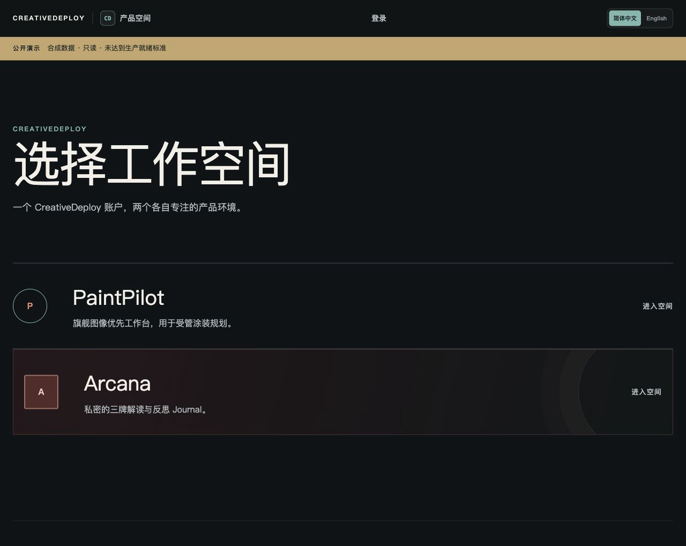
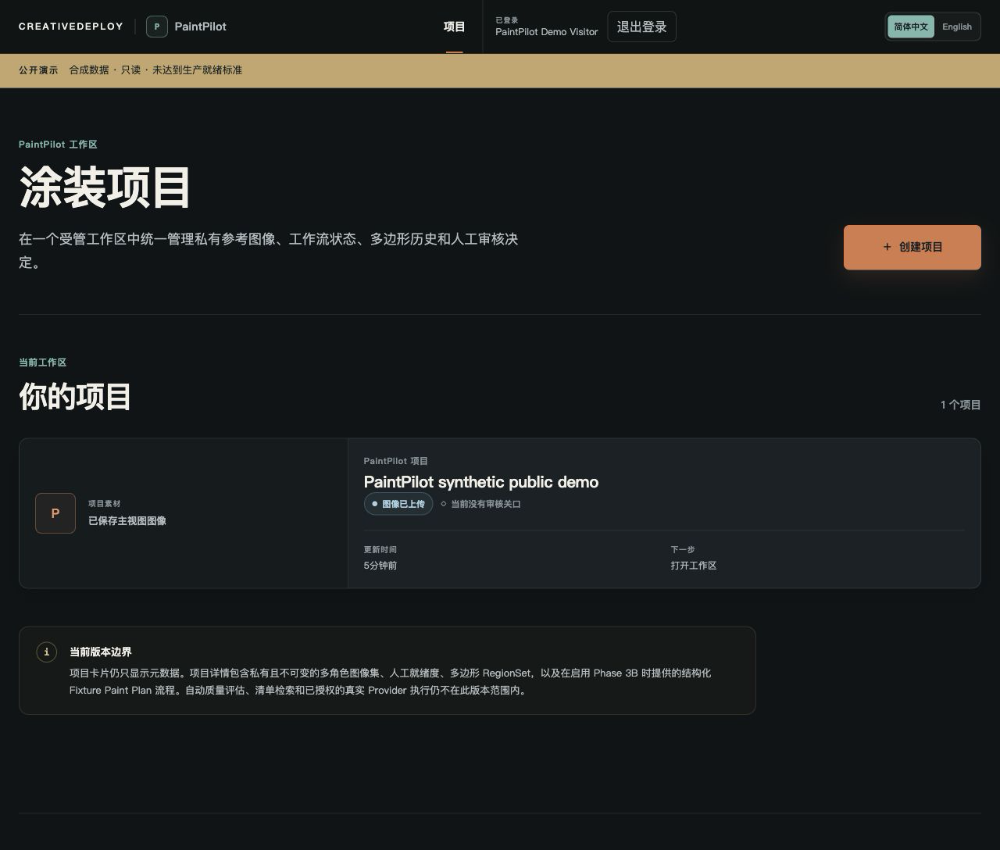
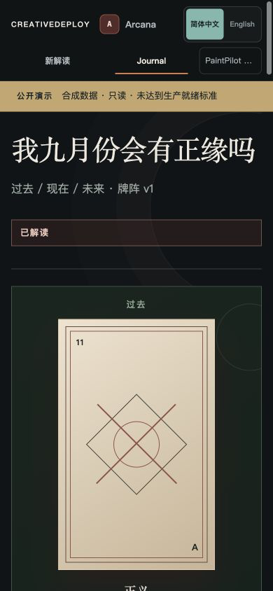

# CreativeDeploy

[English](README.en.md) · [架构](docs/architecture.md) · [证据索引](docs/evidence-index.md) · [演示脚本](docs/demo-script.md)

> 一个面向创意工作流的双产品 AI Application Platform：把可运行的产品体验，与私有数据边界、可追溯检索、Provider 治理和可恢复交付放在同一个 Browser-first 平台中。

CreativeDeploy 不是把一个提示词包进网页。它包含两个真实、不同的问题空间：

- **PaintPilot**：面向手办重涂的图像工作台。用私有素材、ImageSet / RegionSet、结构化 Paint Plan、引用知识与人工审批，替代“上传一张图然后相信模型”的黑箱流程。
- **Arcana**：面向私人三牌解读与反思的系统。它把问题分析、牌位与正逆位、确定性跨牌关系、repository-local 知识和可回溯引用组合起来，而不是逐张牌拼接通用文案。

## 为什么它不只是 AI Demo

| 产品体验 | 平台工程边界 |
| --- | --- |
| 双语 `zh-CN` / `en-US` Browser-first Web | OIDC 会话、项目/所有者授权和私有对象仅经 API 流式交付 |
| PaintPilot 的图像、区域、计划与人工审核 | 加密 BYOK、Provider 注册表、策略、预算预留、耐久 pre-egress claim、幂等与审计 |
| Arcana 的问题感知三牌解读、日记和历史 | repository-local cited RAG、citation/provenance 校验、schema-governed 输出 |
| 可重复的本地体验 | 迁移、合成 staging DR、精确重试与篡改/字节不匹配拒绝 |

真实 Provider 集成已完成独立验证：PaintPilot 对应 GLM-5V-Turbo，Arcana 对应 GLM-5.2。公开 Portfolio Demo 默认保持 **Live OFF、Provider calls = 0**，只使用本地合成数据与可重复 Fixture，不要求招聘方提供 Key。

## 产品预览








所有 Portfolio 截图均来自本地合成、只读 Fixture，不含真实账户、私有项目素材、Credential 或 Provider payload。完整展示顺序见 [演示脚本](docs/demo-script.md)；详细的 PaintPilot Polygon 截图仍保留在 [docs/screenshots/](docs/screenshots/)。

## 5 分钟本地体验

### 最快查看预置 PaintPilot 合成工作台

前提：Docker Desktop（含 Compose）、`curl` 与 `python3`。

```bash
git clone https://github.com/dankk0220abc-prog/creative-deploy.git
cd creative-deploy
make demo-up
```

打开 <http://127.0.0.1:18173/>，在合成本地登录页选择 **PaintPilot Demo Visitor**。从产品入口可查看 PaintPilot 的预置项目、四个合成图片角色、READY 审核和已批准 RegionSet；Arcana 首页会引导到预置的只读 Fixture 解读，可查看问题感知解释、引用和历史。该 Compose profile 使用隔离的 Demo 数据、局部 OIDC 和本地对象存储，不读取你的私有 `.env`，不启用真实 Provider。

```bash
make demo-status  # Web、API、数据库和受限服务状态
make demo-reset   # 仅在配置 guard 成功后重建命名的 Demo volumes 与合成数据
make demo-down    # 停止服务，保留合成 Demo 数据
```

若端口 `18173` 已被占用，命令不会终止未知进程。请先运行 `make demo-status`；需要重新生成合成数据时再运行 `make demo-reset`。不要把该 loopback-only Demo 暴露到公网。

### 本地开发

完整开发环境需要 Node.js 24、Corepack/pnpm 11.14.0、Python 3.13/uv 与 Docker Desktop：

```bash
make bootstrap
make db-up
CREATIVEDEPLOY_ENV_FILE=.env uv run --project apps/api alembic -c apps/api/alembic.ini upgrade head
make api
# 另一个终端：make web
```

访问 <http://127.0.0.1:5173/>。默认 `.env.example` 保持 Live OFF；Phase 3A/3B 的 Fixture gate 也默认关闭，避免把本地开发误变成 Provider egress。详情见 [本地运行说明](docs/runbooks/local-production-style.md)。

## 架构、案例与证据

- [平台架构](docs/architecture.md)：产品边界与 governed Provider invocation flow。
- [PaintPilot Case Study](docs/case-studies/paintpilot.md)：私有图片、provenance、结构化计划与人工审核。
- [Arcana Case Study](docs/case-studies/arcana.md)：从 generic tarot 到 question-aware cited RAG。
- [Evidence Index](docs/evidence-index.md)：Git/CI、迁移/DR、独立高风险审查与 Provider proof 的可核验索引。
- [面试包](docs/portfolio/)：简历 bullet、深挖故事与架构速查表。

## 工程亮点

- **Private by design**：对象不公开；授权、项目策略和所有权在服务端强制执行。
- **Governed AI**：注册表、加密凭据、项目授权、预算/会计、幂等和审计是一次调用的组成部分，而不是事后日志。
- **Citations with provenance**：检索上下文、引用和持久化结果由一致性校验绑定；没有来源不能伪造引用。
- **Local-first delivery**：可重复的合成数据与 loopback-only 演示优先于未授权的公网部署。
- **Honest limits**：当前只对 Zhipu 路径做过 live proof；没有多 Provider live benchmark、公开生产部署或无限规模承诺。

## 仓库结构

```text
apps/api/       FastAPI、领域模型、迁移、Provider/RAG 与治理服务
apps/web/       React/Vite 双语 Browser-first 应用
docs/           架构、案例、运行说明、证据与面试材料
demo/           合成、只读、本地 Demo 数据说明
scripts/        受限验证与运维辅助脚本
```

## 范围与限制

这是公开源代码项目，采用 [Apache-2.0](LICENSE)。它不等于已上线的公共 SaaS。生产身份提供方、托管存储/IAM、密钥管理、域名与证书自动化、监控、保留策略、RPO/RTO 和运营责任仍需要独立设计与授权。当前的部署决定见 [Local-first deployment decision](docs/deployment-decision.md)。

安全问题请遵循 [SECURITY.md](SECURITY.md)，贡献约定见 [CONTRIBUTING.md](CONTRIBUTING.md)。历史工程记录保留在 [docs/progress/](docs/progress/)；它们用于可追溯性，不扩大当前公开产品边界。
