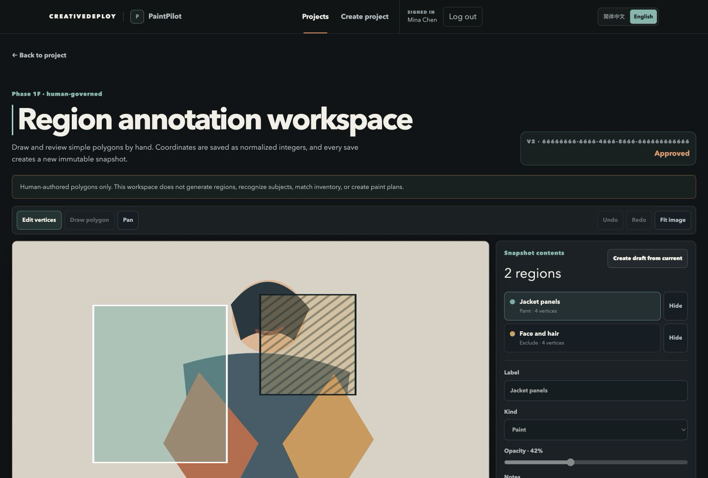
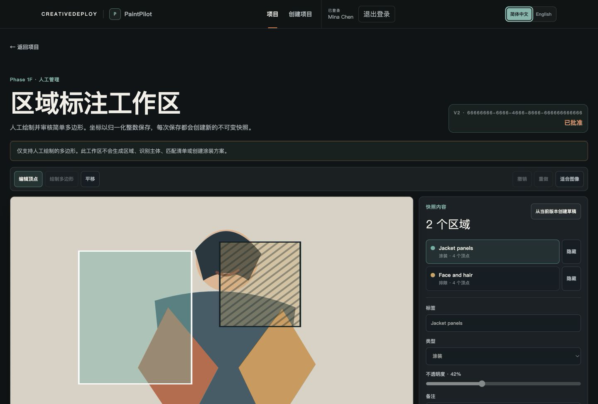
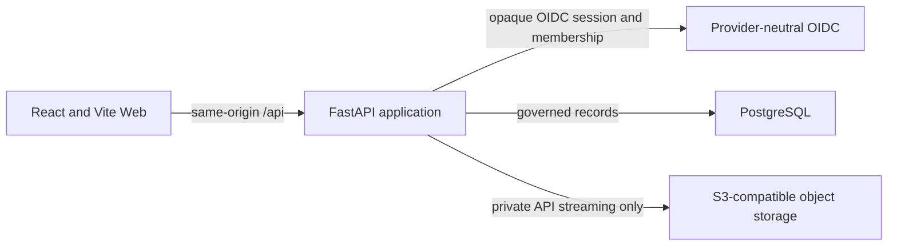

# CreativeDeploy

[](https://github.com/dankk0220abc-prog/creative-deploy/actions/workflows/ci.yml)

PaintPilot is CreativeDeploy's bilingual, image-first workbench for human-governed
repaint planning. It brings private reference images, immutable image history,
reviewer membership, deterministic readiness checks, human-authored Polygon
regions, and append-only review decisions into one workspace.

## Product tour





These synthetic, non-stitched captures show the Polygon editor, an approved
immutable snapshot, and append-only history in the two supported interface
locales. They contain no private project asset or account. The UI supports English
(`en-US`) and Simplified Chinese (`zh-CN`) without translating user-entered titles,
filenames, IDs, UUIDs, hashes, or raw enum values.

## Implemented product boundary

- Create, list, reopen, and inspect server-persisted planning-only PaintProjects.
- Maintain four private immutable image roles with version history, deterministic
  file checks, human rights attestation, and append-only readiness review.
- Grant and revoke reviewer membership through server-authorized Owner controls.
- Draw and edit human-authored Polygon regions, save immutable RegionSet snapshots,
  submit exact snapshots, browse history, and record append-only human review.
- Recover explicitly from loading, empty, validation, network, storage, conflict,
  and unavailable states without substituting sample records.

AI, OCR, Agent workflows, RAG, automated image analysis, segmentation, generated
regions, paint inventory, and PaintPlan generation are not implemented or
authorized.

## Architecture



The Web never receives storage credentials or public object URLs. The API owns
authorization, workflow enforcement, idempotency, persistence, and private-object
delivery. PostgreSQL and object storage remain independent durable boundaries.

## Five-minute synthetic Demo

This is a loopback-only, read-only synthetic Demo for product evaluation. It is
not a public website and is not production-ready. It creates no cloud account,
uses no real credential, and does not read your private `.env` file.

Prerequisites are Docker Desktop with Docker Compose, `curl`, and `python3`.
From a fresh clone:

```bash
git clone https://github.com/dankk0220abc-prog/creative-deploy.git
cd creative-deploy
make demo-up
```

Open `http://127.0.0.1:18173/paintpilot/projects`, choose the single
**PaintPilot Demo Visitor** on the synthetic local sign-in page, then open the
preloaded project. You can inspect four synthetic images, the human READY
review, and the approved RegionSet/Polygon workspace. The banner marks the
entire dataset as synthetic and read-only.

```bash
make demo-status  # Web, API, readiness, database, and scoped service checks
make demo-reset   # removes only the named Demo volumes and recreates synthetic data
make demo-down    # stops services but keeps the synthetic Demo data
```

If port `18173` is in use, stop its known owner or leave it running; the command
will not kill an unknown process. If a Demo service is unhealthy, run
`make demo-status`; if the isolated dataset is incomplete, run `make demo-reset`.
The reset guard rejects configuration drift before deleting anything.

For the provider, TLS, secret, persistence, cost, and authorization requirements
of a real public deployment, see the [Phase 2E deployment preparation](docs/runbooks/public-demo-deployment.md).

## Local development start

Prerequisites are Node.js 24, Corepack with pnpm 11.14.0, Python 3.13 with `uv`,
Docker Desktop, and Docker Compose. From the repository root:

```bash
make bootstrap
make db-up
make api
make web
```

`make bootstrap` creates `.env` from `.env.example` only when `.env` is absent; it
does not overwrite a private environment file. Open `http://127.0.0.1:5173`. The
development Web uses same-origin `/api` requests through the Vite proxy.

## Authentication, storage, staging, and recovery

- Local development may use the explicit configured Demo Principal and private
  local-file adapter. Both are rejected for production.
- The implemented governed boundary uses provider-neutral OIDC Authorization Code
  + PKCE, opaque HttpOnly sessions, server-side Owner/reviewer membership, and
  private S3-compatible object access through the API only.
- The repository's staging topology is synthetic and loopback-only. It is evidence
  for a deployment boundary, not a real environment or provider selection.
- Backup is quiesced and manifest-bound. Restore targets a fresh isolated
  environment; the repository does not provide destructive in-place promotion.

See the [security policy](SECURITY.md),
[local production-style operations](docs/runbooks/local-production-style.md), and
[staging and backup/restore operations](docs/runbooks/staging-operations.md).

## Quality and CI

The GitHub Actions [Candidate CI](.github/workflows/ci.yml) workflow runs on pull
requests and on `main`. It installs locked dependencies and exercises the
repository's configured checks, migration checks, artifact checks, staging drill,
and supply-chain check. Run focused local checks that match your change; common
Web checks are:

```bash
make lint-web
make typecheck-web
make test-web
make build-web
git diff --check
```

## Public source status and limitations

CreativeDeploy is a public-source repository, and the public source release is
complete under Apache-2.0. That status does not make the project production-ready.

A real identity provider, managed storage and IAM, secret management, production
domain and certificate automation, monitoring, retention, RPO/RTO, and operational
ownership have not been completed. There is no public production deployment. See
the engineering record for historical implementation and review evidence.

## Security and contributing

Read [SECURITY.md](SECURITY.md) before reporting a vulnerability, and follow
[CONTRIBUTING.md](CONTRIBUTING.md) for changes. Do not place credentials, real
customer material, or private environment files in issues, pull requests, or the
repository.

## License

Licensed under the [Apache License 2.0](LICENSE).

## Engineering history

Historical phase plans, Candidate records, focused reviews, and closure evidence
are preserved in [docs/progress/](docs/progress/). They document engineering
history and do not expand the current product or production boundary.
