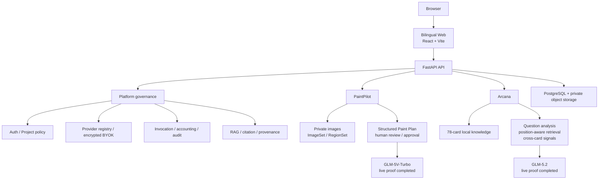
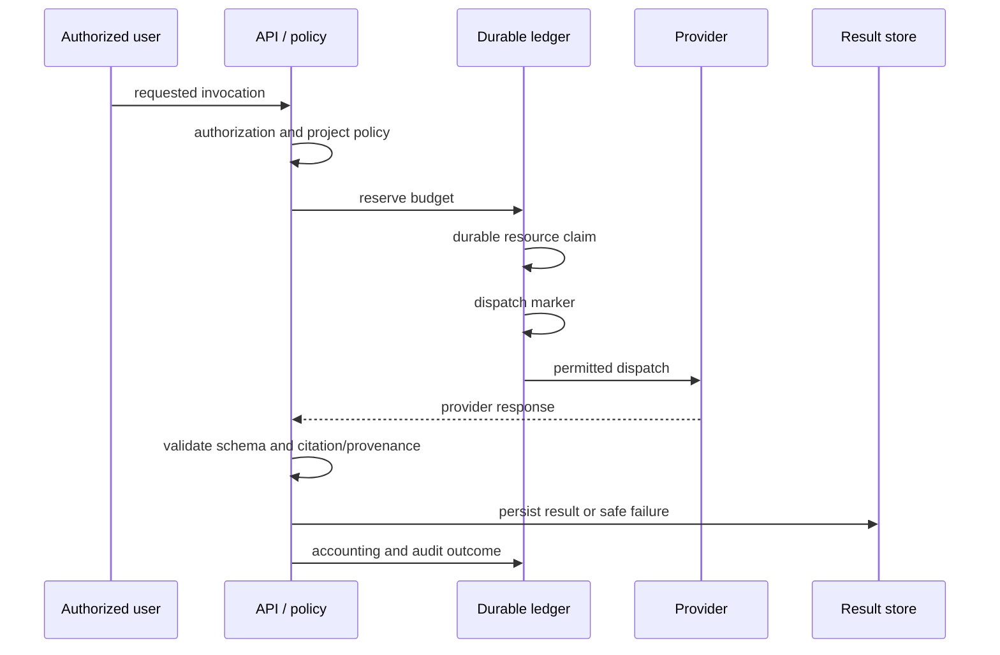

# CreativeDeploy architecture

[首页](../README.md) · [Evidence index](evidence-index.md)

CreativeDeploy deliberately shares a governance platform while keeping PaintPilot and Arcana as separate product domains. The shared layer owns identity, authorization, provider policy, accounting, audit, retrieval provenance, persistence, and recovery boundaries; it does not force Arcana through PaintPilot image-domain contracts.

## Product boundaries

**PaintPilot** treats source images, roles, region geometry, knowledge, generated plans, and human decisions as versioned workflow facts. Private objects remain private, and a plan cannot claim a citation that is not bound to real, accessible retrieved context.

**Arcana** persists the draw as immutable facts: three ordered cards, their positions and orientations. A user-owned Journal is separate from the system interpretation. The retrieval/synthesis path is question-aware, compact, citation-backed, and schema-governed; a future tendency is not represented as a guaranteed outcome.

## Governed Provider invocation flow

The order matters: policy, reservation, durable claim, and dispatch state make egress/accounting outcomes explainable under retries and concurrency. Safe metadata may preserve narrow diagnostic facts; raw credentials, private images, and raw provider payloads are not public evidence.

## Local-first demonstration boundary

The Portfolio path runs with synthetic/Fixture data, isolated local services, **Live OFF**, and **Provider calls = 0**. It demonstrates the same product surfaces without asking an evaluator to supply a key or expose personal images. A public deployment would introduce a different set of identity, storage, secret-management, operational, and incident-response responsibilities; it is intentionally not implied by this repository.
