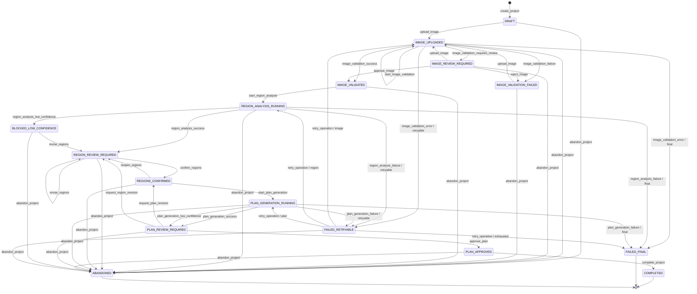

# PaintPilot Workflow State Machine v0.1

## 1. Document Metadata

- Document Status: `APPROVED_FOR_IMPLEMENTATION`
- Version: `0.1.1`
- Implementation Status: `NOT_STARTED`
- Related Product Contract: `docs/product/paintpilot-mvp-product-contract-v0.1.md`

本实现基线固定 16 个状态、47 条 Transition、17 个编号 Guard，以及额外的横切 Principal 和 Ownership Guard；获批不表示这些能力已经运行。

## 2. Design Principles

- 数据库中的 `PaintProject.status` 是当前状态的事实来源。
- LLM 只能返回结构化建议，不能直接更新项目状态或创建人工审批。
- 所有状态变化由后端命令与 Guard 决定，并与 `StateTransitionEvent` 在同一数据库事务中持久化。
- actor_type 只允许 `user`、`api`、`worker`、`system`；每个状态事件还必须记录可验证的 actor_principal_id，LLM 不是 actor。
- 人工审批是显式事件，必须绑定确切版本。
- 图片人工复核是附加人工检查，不取代区域和方案两个核心业务 Gate。
- 自动重试依据 `AgentRun.operation_type`、`resume_state`、`retry_count` 和 `max_retries`，不能依赖无 Schema metadata 猜测恢复位置。
- 用户主动放弃进入 `ABANDONED`；技术失败进入 `FAILED_FINAL`，二者不得混用。
- 运行中取消采用 best-effort cooperative cancellation，不承诺物理终止已发出的 Provider 请求。
- worker 写入成功结果前必须确认项目不是终态且 `cancel_requested_at is null`；迟到结果只允许记为 `discarded`。
- 本文档描述计划中的 MVP 行为，不表示状态机已经实现。

## 3. State Inventory

MVP 定义 16 个状态：

1. `DRAFT`
2. `IMAGE_UPLOADED`
3. `IMAGE_REVIEW_REQUIRED`
4. `IMAGE_VALIDATION_FAILED`
5. `IMAGE_VALIDATED`
6. `REGION_ANALYSIS_RUNNING`
7. `REGION_REVIEW_REQUIRED`
8. `REGIONS_CONFIRMED`
9. `PLAN_GENERATION_RUNNING`
10. `PLAN_REVIEW_REQUIRED`
11. `PLAN_APPROVED`
12. `COMPLETED`
13. `BLOCKED_LOW_CONFIDENCE`
14. `FAILED_RETRYABLE`
15. `FAILED_FINAL`
16. `ABANDONED`

终态为 `COMPLETED`、`FAILED_FINAL` 和 `ABANDONED`。

## 4. State Definitions

| State | Meaning | Entry Condition | Allowed Operations | Prohibited Operations | Allowed Next State | Human Action | Retry |
| --- | --- | --- | --- | --- | --- | --- | --- |
| `DRAFT` | 项目已创建，尚无有效主图。 | `create_project` 成功。 | 上传图片、放弃项目。 | 图片分析、区域确认、方案生成。 | `IMAGE_UPLOADED`, `ABANDONED` | 上传动作 | No |
| `IMAGE_UPLOADED` | 不可变主图和权利声明已保存，图片质量结论尚未确定。 | `upload_image` 成功，或图片校验 retry 恢复。 | 启动校验、接收校验结果、放弃项目。 | 未验证即分析区域。 | `IMAGE_UPLOADED`, `IMAGE_REVIEW_REQUIRED`, `IMAGE_VALIDATION_FAILED`, `IMAGE_VALIDATED`, `FAILED_RETRYABLE`, `FAILED_FINAL`, `ABANDONED` | 权利声明可更新 | Validation retry: 1 by default |
| `IMAGE_REVIEW_REQUIRED` | 质量结果为 review，必须由用户决定是否允许进入 planning-only 流程。 | `image_validation_requires_review`。 | 批准、拒绝、重新上传、放弃。 | 自动通过、区域分析、精确颜色校准声明。 | `IMAGE_VALIDATED`, `IMAGE_VALIDATION_FAILED`, `IMAGE_UPLOADED`, `ABANDONED` | Yes, supplemental review | No |
| `IMAGE_VALIDATION_FAILED` | 图片质量规则明确不通过或用户拒绝。 | `image_validation_failure` 或 `reject_image`。 | 查看原因、上传替代图片、放弃。 | 区域分析、方案生成。 | `IMAGE_UPLOADED`, `ABANDONED` | Yes | User re-upload only |
| `IMAGE_VALIDATED` | 图片已通过 Policy，或用户明确允许 review 图片继续规划。 | `image_validation_success` 或 `approve_image`。 | 启动区域分析、放弃。 | 直接确认区域、生成方案。 | `REGION_ANALYSIS_RUNNING`, `ABANDONED` | Review Approval may already exist | No |
| `REGION_ANALYSIS_RUNNING` | 区域分析 AgentRun 正在执行。 | `start_region_analysis` Guard 通过，或 retry 恢复。 | worker 写入建议/失败；用户放弃。 | 用户确认、并发分析、方案生成。 | `REGION_REVIEW_REQUIRED`, `BLOCKED_LOW_CONFIDENCE`, `FAILED_RETRYABLE`, `FAILED_FINAL`, `ABANDONED` | Optional abandon | Bounded, default 2 |
| `REGION_REVIEW_REQUIRED` | 完整语义和几何快照等待用户编辑或确认。 | 分析成功、低置信度接管或区域返工。 | 编辑、确认、放弃。 | 未确认即生成方案。 | `REGION_REVIEW_REQUIRED`, `REGIONS_CONFIRMED`, `ABANDONED` | Yes, blocking Gate | No |
| `REGIONS_CONFIRMED` | 当前完整 `RegionGeometryVersion` 已获用户确认。 | `confirm_regions`。 | 启动方案生成、重新打开区域、放弃。 | 静默修改已确认快照、直接完成。 | `REGION_REVIEW_REQUIRED`, `PLAN_GENERATION_RUNNING`, `ABANDONED` | Confirmation recorded | No |
| `PLAN_GENERATION_RUNNING` | 库存、检索和方案生成 AgentRun 正在执行。 | `start_plan_generation` Guard 通过，或 retry 恢复。 | worker 写入方案/失败；用户放弃。 | 审批未完成方案、并发生成。 | `PLAN_REVIEW_REQUIRED`, `FAILED_RETRYABLE`, `FAILED_FINAL`, `ABANDONED` | Optional abandon | Bounded, default 2 |
| `PLAN_REVIEW_REQUIRED` | 当前 PaintPlan 等待用户审批。 | 方案、库存和 Citation 校验通过。 | 批准、只修订方案、返工区域、放弃。 | 未审批即完成、LLM 自行批准。 | `PLAN_APPROVED`, `REGIONS_CONFIRMED`, `REGION_REVIEW_REQUIRED`, `ABANDONED` | Yes, blocking Gate | Revision creates/resumes a run |
| `PLAN_APPROVED` | 当前 PaintPlan 版本已被用户批准。 | `approve_plan`。 | 完成项目、放弃。 | 修改已批准版本、跳过审计。 | `COMPLETED`, `ABANDONED` | Approval recorded | No |
| `COMPLETED` | planning-only 工作流完成并保存版本与 Trace。 | `complete_project` Guard 通过。 | 只读查看与导出规划记录。 | 修改、重试、放弃。 | None | No | No |
| `BLOCKED_LOW_CONFIDENCE` | 区域分析置信度不足，等待人工接管。 | `region_analysis_low_confidence`。 | 查看原因、进入人工编辑、放弃。 | 自动继续、模型自行解除阻塞。 | `REGION_REVIEW_REQUIRED`, `ABANDONED` | Yes | No automatic retry |
| `FAILED_RETRYABLE` | 技术操作失败但仍有重试额度。 | retryable error 且次数未超限。 | 查看原因、受限 retry、放弃。 | 无限重试、猜测恢复位置。 | `IMAGE_UPLOADED`, `REGION_ANALYSIS_RUNNING`, `PLAN_GENERATION_RUNNING`, `FAILED_FINAL`, `ABANDONED` | Optional | Yes, bounded |
| `FAILED_FINAL` | 技术错误不可恢复、数据无法恢复或重试耗尽。 | final failure 或 retry exhausted。 | 只读查看失败与审计信息。 | 重试、生成、审批、完成、放弃。 | None | No | No |
| `ABANDONED` | 用户主动终止项目；不属于技术失败。 | 任一非终态执行 `abandon_project`。 | 只读查看；记录迟到结果为 discarded。 | 恢复、生成、审批、完成、保存迟到结果为当前结果。 | None | User initiated | No |

## 5. Retry Defaults and Recovery Context

| operation_type | Default max_retries | resume_state | retry target |
| --- | ---: | --- | --- |
| `image_validation` | 1 | `IMAGE_UPLOADED` | `IMAGE_UPLOADED`；重新分派同一受审计操作 |
| `region_analysis` | 2 | `IMAGE_VALIDATED` | `REGION_ANALYSIS_RUNNING` |
| `plan_generation` | 2 | `REGIONS_CONFIRMED` | `PLAN_GENERATION_RUNNING` |

默认值必须可配置。`retry_operation` 必须读取结构化 AgentRun 字段，增加同一运行的 retry_count，并拒绝缺少 operation_type、resume_state 或重试额度的请求。

## 6. Transition Table

每次转换创建一条 `StateTransitionEvent`。同状态的 `start_image_validation` 也记录命令审计。side effect 是计划行为，不表示已经实现。

| from_state | event | actor | guard | to_state | side_effect | audit_event |
| --- | --- | --- | --- | --- | --- | --- |
| `[*]` | `create_project` | `user` | 标题有效；幂等契约通过 | `DRAFT` | 创建 PaintProject | `project_created` |
| `DRAFT` | `upload_image` | `user` | 上传契约和幂等契约通过 | `IMAGE_UPLOADED` | 创建不可变 ImageAsset 与权利 attestation | `image_uploaded` |
| `IMAGE_UPLOADED` | `start_image_validation` | `api` | 当前资产有效；无运行中的 image_validation AgentRun | `IMAGE_UPLOADED` | 创建 operation_type=image_validation 的 AgentRun | `image_validation_started` |
| `IMAGE_UPLOADED` | `image_validation_success` | `worker` | decision=pass；Policy 合法；cancel_requested_at is null | `IMAGE_VALIDATED` | 保存 ImageQualityAssessment；关闭 AgentRun | `image_validation_passed` |
| `IMAGE_UPLOADED` | `image_validation_requires_review` | `worker` | decision=review；Policy 合法；cancel_requested_at is null | `IMAGE_REVIEW_REQUIRED` | 保存 Assessment 与 review reasons；AgentRun succeeded | `image_validation_review_required` |
| `IMAGE_UPLOADED` | `image_validation_failure` | `worker` | decision=fail；Policy 合法；cancel_requested_at is null | `IMAGE_VALIDATION_FAILED` | 保存失败 Assessment；AgentRun succeeded | `image_validation_failed` |
| `IMAGE_UPLOADED` | `image_validation_error` | `worker` | error retryable；retry_count < max_retries；cancel_requested_at is null | `FAILED_RETRYABLE` | 保存 operation_type=image_validation、resume_state=IMAGE_UPLOADED 和错误 | `image_validation_error_retryable` |
| `IMAGE_UPLOADED` | `image_validation_error` | `worker` | error 不可重试或 retry_count >= max_retries；cancel_requested_at is null | `FAILED_FINAL` | 关闭 AgentRun并保存技术原因 | `image_validation_error_final` |
| `IMAGE_REVIEW_REQUIRED` | `approve_image` | `user` | 目标 Assessment 为当前版本；reason 非空 | `IMAGE_VALIDATED` | 创建 approval_type=image_quality 的 approved HumanApproval | `image_review_approved` |
| `IMAGE_REVIEW_REQUIRED` | `reject_image` | `user` | 目标 Assessment 为当前版本；reason 非空 | `IMAGE_VALIDATION_FAILED` | 创建 approval_type=image_quality 的 rejected HumanApproval | `image_review_rejected` |
| `IMAGE_REVIEW_REQUIRED` | `upload_image` | `user` | 新文件满足上传契约与幂等契约 | `IMAGE_UPLOADED` | 创建新 ImageAsset；旧文件与 Assessment 保留 | `replacement_image_uploaded` |
| `IMAGE_VALIDATION_FAILED` | `upload_image` | `user` | 新文件满足上传契约与幂等契约 | `IMAGE_UPLOADED` | 创建新 ImageAsset；旧文件与 Assessment 保留 | `replacement_image_uploaded` |
| `IMAGE_VALIDATED` | `start_region_analysis` | `api` | 图片当前有效；rights=confirmed；无运行中的区域 AgentRun | `REGION_ANALYSIS_RUNNING` | 创建 operation_type=region_analysis 的 AgentRun | `region_analysis_started` |
| `REGION_ANALYSIS_RUNNING` | `region_analysis_success` | `worker` | Schema 合法；至少一个候选区域；cancel_requested_at is null | `REGION_REVIEW_REQUIRED` | 保存 RegionSuggestion 和完整 draft snapshot；AgentRun succeeded | `region_suggestions_ready` |
| `REGION_ANALYSIS_RUNNING` | `region_analysis_low_confidence` | `worker` | 输出合法；Policy 要求人工接管；cancel_requested_at is null | `BLOCKED_LOW_CONFIDENCE` | 保存建议和 uncertainty reason；AgentRun blocked | `region_analysis_blocked_low_confidence` |
| `REGION_ANALYSIS_RUNNING` | `region_analysis_failure` | `worker` | error retryable；retry_count < max_retries；cancel_requested_at is null | `FAILED_RETRYABLE` | 保存 resume_state=IMAGE_VALIDATED 和错误；AgentRun failed | `region_analysis_failed_retryable` |
| `REGION_ANALYSIS_RUNNING` | `region_analysis_failure` | `worker` | error 不可重试或次数已耗尽；cancel_requested_at is null | `FAILED_FINAL` | 关闭 AgentRun 并保存原因 | `region_analysis_failed_final` |
| `BLOCKED_LOW_CONFIDENCE` | `revise_regions` | `user` | 用户接受人工编辑责任 | `REGION_REVIEW_REQUIRED` | 创建用户编辑的完整 RegionGeometryVersion | `manual_region_review_started` |
| `REGION_REVIEW_REQUIRED` | `revise_regions` | `user` | 新快照通过语义与几何校验 | `REGION_REVIEW_REQUIRED` | 创建新 RegionGeometryVersion | `region_snapshot_revised` |
| `REGION_REVIEW_REQUIRED` | `confirm_regions` | `user` | 当前完整快照有效且未过期；幂等契约通过 | `REGIONS_CONFIRMED` | 创建绑定 RegionGeometryVersion 的 HumanApproval | `regions_confirmed` |
| `REGIONS_CONFIRMED` | `reopen_regions` | `user` | reason 非空；新 draft snapshot 可创建 | `REGION_REVIEW_REQUIRED` | 新建快照；supersede 旧 Approval；旧计划 stale/superseded；旧 Citation 不转移 | `regions_reopened` |
| `REGIONS_CONFIRMED` | `start_plan_generation` | `api` | 区域 Approval 和 Style 有效；库存可解释；无并发运行；幂等契约通过 | `PLAN_GENERATION_RUNNING` | 创建 operation_type=plan_generation 的 AgentRun | `plan_generation_started` |
| `PLAN_GENERATION_RUNNING` | `plan_generation_success` | `worker` | PaintPlan、库存和 Citation 一致性通过；cancel_requested_at is null | `PLAN_REVIEW_REQUIRED` | 保存新 PaintPlan；AgentRun succeeded | `paint_plan_ready` |
| `PLAN_GENERATION_RUNNING` | `plan_generation_low_confidence` | `worker` | Schema 合法；uncertainties 要求人工判断；cancel_requested_at is null | `PLAN_REVIEW_REQUIRED` | 保存带结构化 uncertainties 的 PaintPlan；AgentRun succeeded | `paint_plan_ready_low_confidence` |
| `PLAN_GENERATION_RUNNING` | `plan_generation_failure` | `worker` | error retryable；retry_count < max_retries；cancel_requested_at is null | `FAILED_RETRYABLE` | 保存 resume_state=REGIONS_CONFIRMED 和错误；AgentRun failed | `plan_generation_failed_retryable` |
| `PLAN_GENERATION_RUNNING` | `plan_generation_failure` | `worker` | error 不可重试或次数已耗尽；cancel_requested_at is null | `FAILED_FINAL` | 关闭 AgentRun 并保存原因 | `plan_generation_failed_final` |
| `PLAN_REVIEW_REQUIRED` | `approve_plan` | `user` | decision=approved；目标为当前版本；幂等契约通过 | `PLAN_APPROVED` | 创建版本绑定 HumanApproval | `paint_plan_approved` |
| `PLAN_REVIEW_REQUIRED` | `request_plan_revision` | `user` | reason 非空；区域版本保持不变 | `REGIONS_CONFIRMED` | 旧计划 revision_requested；Citation 留在旧计划 | `paint_plan_revision_requested` |
| `PLAN_REVIEW_REQUIRED` | `request_region_revision` | `user` | reason 非空；新 draft snapshot 可创建 | `REGION_REVIEW_REQUIRED` | 新建快照；supersede 区域 Approval；旧计划 stale/superseded；清除/更新 current_plan_id | `region_revision_requested` |
| `PLAN_APPROVED` | `complete_project` | `api` | 当前计划 Approval 有效；Trace 事务满足 | `COMPLETED` | 写入完成时间与最终版本引用 | `project_completed` |
| `FAILED_RETRYABLE` | `retry_operation` | `api` | operation=image_validation；resume=IMAGE_UPLOADED；次数仍可用 | `IMAGE_UPLOADED` | 增加 retry_count；重启同一 AgentRun 操作 | `image_validation_retry_started` |
| `FAILED_RETRYABLE` | `retry_operation` | `api` | operation=region_analysis；resume=IMAGE_VALIDATED；次数仍可用 | `REGION_ANALYSIS_RUNNING` | 增加 retry_count；重启同一 AgentRun 操作 | `region_analysis_retry_started` |
| `FAILED_RETRYABLE` | `retry_operation` | `api` | operation=plan_generation；resume=REGIONS_CONFIRMED；次数仍可用 | `PLAN_GENERATION_RUNNING` | 增加 retry_count；重启同一 AgentRun 操作 | `plan_generation_retry_started` |
| `FAILED_RETRYABLE` | `retry_operation` | `api` | retry_count >= max_retries | `FAILED_FINAL` | 标记重试耗尽 | `retry_exhausted` |
| `DRAFT` | `abandon_project` | `user` | reason 非空 | `ABANDONED` | 记录主动放弃 | `project_abandoned` |
| `IMAGE_UPLOADED` | `abandon_project` | `user` | reason 非空 | `ABANDONED` | 请求取消当前校验 run（如有） | `project_abandoned` |
| `IMAGE_REVIEW_REQUIRED` | `abandon_project` | `user` | reason 非空 | `ABANDONED` | 记录主动放弃 | `project_abandoned` |
| `IMAGE_VALIDATION_FAILED` | `abandon_project` | `user` | reason 非空 | `ABANDONED` | 记录主动放弃 | `project_abandoned` |
| `IMAGE_VALIDATED` | `abandon_project` | `user` | reason 非空 | `ABANDONED` | 记录主动放弃 | `project_abandoned` |
| `REGION_ANALYSIS_RUNNING` | `abandon_project` | `user` | reason 非空 | `ABANDONED` | 写入 AgentRun.cancel_requested_at；迟到结果 discarded | `project_abandoned_during_run` |
| `REGION_REVIEW_REQUIRED` | `abandon_project` | `user` | reason 非空 | `ABANDONED` | 记录主动放弃 | `project_abandoned` |
| `REGIONS_CONFIRMED` | `abandon_project` | `user` | reason 非空 | `ABANDONED` | 记录主动放弃 | `project_abandoned` |
| `PLAN_GENERATION_RUNNING` | `abandon_project` | `user` | reason 非空 | `ABANDONED` | 写入 AgentRun.cancel_requested_at；迟到结果 discarded | `project_abandoned_during_run` |
| `PLAN_REVIEW_REQUIRED` | `abandon_project` | `user` | reason 非空 | `ABANDONED` | 记录主动放弃 | `project_abandoned` |
| `PLAN_APPROVED` | `abandon_project` | `user` | reason 非空 | `ABANDONED` | 记录主动放弃 | `project_abandoned` |
| `BLOCKED_LOW_CONFIDENCE` | `abandon_project` | `user` | reason 非空 | `ABANDONED` | 记录主动放弃 | `project_abandoned` |
| `FAILED_RETRYABLE` | `abandon_project` | `user` | reason 非空 | `ABANDONED` | 取消后续 retry | `project_abandoned` |

## 7. Guard Rules

| Guard ID | Rule | Planned Error |
| --- | --- | --- |
| `G-001` | 上传必须满足 MIME、magic bytes、20 MiB、768–8192 px、静态图片和 SHA-256 契约。 | `IMAGE_UPLOAD_INVALID` |
| `G-002` | 图片 Assessment 必须使用版本化 Policy，decision 只允许 pass/review/fail。 | `IMAGE_POLICY_INVALID` |
| `G-003` | `approve_image/reject_image` 必须由用户执行并绑定当前 ImageQualityAssessment。 | `IMAGE_REVIEW_STALE` |
| `G-004` | 未进入 IMAGE_VALIDATED 或 rights_attestation_status != confirmed 时不能开始区域分析。 | `IMAGE_OR_RIGHTS_NOT_VALIDATED` |
| `G-005` | worker 成功/失败结果写入前，项目必须非终态且 AgentRun.cancel_requested_at is null；否则只记 discarded。 | `RUN_CANCELLED_RESULT_DISCARDED` |
| `G-006` | RegionSuggestion 未通过 Schema、未知标签未处理或完整 RegionGeometryVersion 无效时不能确认区域。 | `REGION_SNAPSHOT_INVALID` |
| `G-007` | 没有绑定当前完整 RegionGeometryVersion 的区域 Approval 时不能生成方案。 | `REGION_APPROVAL_REQUIRED` |
| `G-008` | 区域返工必须原子 supersede 旧 Approval、使旧计划 stale/superseded，并禁止迁移旧 Citation。 | `REGION_REVISION_INVALIDATION_FAILED` |
| `G-009` | 没有有效库存时返回明确缺失状态，不得由模型填充具体产品或拥有状态。 | `INVENTORY_DATA_INCOMPLETE` |
| `G-010` | 没有真实、可访问 KnowledgeChunk 时不能创建 Citation。 | `CITATION_SOURCE_REQUIRED` |
| `G-011` | PaintPlan、库存、Citation 或 uncertainties 不合法时不能进入 PLAN_REVIEW_REQUIRED。 | `PLAN_VALIDATION_FAILED` |
| `G-012` | 用户没有批准当前 PaintPlan 时不能进入 PLAN_APPROVED 或 COMPLETED。 | `PLAN_APPROVAL_REQUIRED` |
| `G-013` | retry 必须匹配 operation_type、resume_state、retry_count 和 max_retries；耗尽时必须 FAILED_FINAL。 | `RETRY_CONTEXT_INVALID` |
| `G-014` | LLM/ModelCall 不能直接创建 HumanApproval 或写项目状态。 | `ACTOR_NOT_AUTHORIZED` |
| `G-015` | 对旧版本的图片 Assessment、区域快照或方案审批必须拒绝。 | `STALE_VERSION` |
| `G-016` | 用户放弃只进入 ABANDONED；FAILED_FINAL 只用于技术终止。 | `TERMINAL_REASON_MISMATCH` |
| `G-017` | PaintProject.status 与 StateTransitionEvent 必须在同一数据库事务提交。 | `AUDIT_TRANSACTION_REQUIRED` |

### 7.1 Human Action Principal Guard

这是覆盖现有转换表与 G-001—G-017 的横切身份校验，不新增 Guard ID，也不改变现有 Guard 的业务语义。

以下事件必须归因于经过验证且 `principal_type=human` 的 Principal：

- `approve_image`
- `reject_image`
- `confirm_regions`
- `approve_plan`
- `request_plan_revision`
- `request_region_revision`
- `reopen_regions`
- `abandon_project`

API 或 worker 可以接收、调度或执行命令，但 StateTransitionEvent.actor_principal_id 必须保留发出该人工动作的已验证 human principal_id，不能使用自由文本名称或执行进程身份替代。HumanApproval.reviewer_principal_id 必须来自同一 human Principal，并通过 `target_type + target_id` 绑定经校验的确切目标。worker 不得自行生成用户 Approval；system actor 可以执行自动转换，但不得创建 decision=approved 的 HumanApproval，也不得把结果自动标记为 approved。

### 7.2 Project Ownership Guard

创建项目时，系统从当前 Principal 写入 PaintProject.owner_principal_id，客户端不得覆盖。项目存在后，任何修改其状态的命令都必须满足：

`current_principal_id == PaintProject.owner_principal_id`

唯一执行例外是已处于授权项目上下文中的 worker 或 system：它们必须携带同一 `project_id` 和 `initiating_principal_id`，且 initiating_principal_id 已通过该项目所有权校验。worker/system 不得跨项目读取或写入图片、库存、文档、区域、方案、Approval 或 Trace；执行进程身份不能替代 initiating_principal_id。

## 8. Cooperative Cancellation and Late Results

1. 在运行状态执行 `abandon_project` 时，项目与状态事件同事务进入 `ABANDONED`，并写入当前 AgentRun.cancel_requested_at。
2. MVP 不保证物理取消已发送的 Provider 请求。
3. Provider 返回后，worker 必须再次读取项目状态与 cancel_requested_at。
4. 若项目已 ABANDONED 或 cancel_requested_at 非空，ModelCall 可更新为 `discarded`，AgentRun 更新为 `cancelled`。
5. discarded 结果不得创建当前 RegionSuggestion、RegionGeometryVersion、PaintPlan 或 Approval，不得触发后续状态。
6. 外部观测平台失败不改变数据库中的 ABANDONED 事实。

## 9. Mermaid State Diagram

## 10. Invalid Transition Examples

| Example | Invalid Attempt | Why Invalid | Planned Business Error |
| --- | --- | --- | --- |
| 1 | `IMAGE_UPLOADED` → `start_region_analysis` | 图片尚未验证或 rights 未确认。 | `IMAGE_OR_RIGHTS_NOT_VALIDATED` |
| 2 | `IMAGE_REVIEW_REQUIRED` 自动进入 `IMAGE_VALIDATED` | review 必须由用户决定并创建 Approval。 | `ACTOR_NOT_AUTHORIZED` |
| 3 | `IMAGE_UPLOADED` 的技术校验错误写为 `IMAGE_VALIDATION_FAILED` | 技术故障与质量不合格必须分开。 | `INVALID_STATE_TRANSITION` |
| 4 | `REGION_REVIEW_REQUIRED` → `start_plan_generation` | 完整区域快照没有 Approval。 | `REGION_APPROVAL_REQUIRED` |
| 5 | `request_region_revision` 后继续使用旧 PaintPlan | 区域返工必须使旧计划 stale/superseded。 | `REGION_REVISION_INVALIDATION_FAILED` |
| 6 | ModelCall 直接把状态改为 `REGIONS_CONFIRMED` | LLM 不是 actor，也不能创建人工审批。 | `ACTOR_NOT_AUTHORIZED` |
| 7 | `PLAN_GENERATION_RUNNING` → `PLAN_REVIEW_REQUIRED`，但 Schema 无效 | 方案没有通过确定性校验。 | `PLAN_VALIDATION_FAILED` |
| 8 | `PLAN_REVIEW_REQUIRED` → `COMPLETED` | 缺少当前计划版本 Approval。 | `PLAN_APPROVAL_REQUIRED` |
| 9 | `FAILED_RETRYABLE` retry，但 resume_state 与 operation_type 不匹配 | 恢复位置不能从 metadata 猜测。 | `RETRY_CONTEXT_INVALID` |
| 10 | 已达到 max_retries 后再次 retry | 重试必须进入 FAILED_FINAL。 | `RETRY_LIMIT_EXCEEDED` |
| 11 | `ABANDONED` 项目保存迟到 PaintPlan 为当前结果 | cooperative cancellation 禁止迟到结果恢复项目。 | `RUN_CANCELLED_RESULT_DISCARDED` |
| 12 | 用户主动放弃进入 `FAILED_FINAL` | 主动终止必须使用独立终态。 | `TERMINAL_REASON_MISMATCH` |
