# Case study: Arcana

[首页](../../README.md) · [架构](../architecture.md) · [Evidence](../evidence-index.md)

## The real problem

Arcana was not built to make “tarot text.” The initial failure was clear in product feedback: the result was only explaining cards one by one and was not answering the user’s question. Connecting a model was not the missing capability; retrieval and synthesis were organized around the wrong unit of meaning.

## Product insight

A three-card reading needs the question’s domain, intent and temporal frame alongside card identity, orientation and position. The Future position should communicate a tendency, not a promise. That requires deterministic analysis before generation, compact context rather than a generic prompt dump, and citations a reader can inspect.

## V2 architecture

```mermaid
flowchart LR
  q["Question"] --> framing["Domain / intent / temporal frame"]
  framing --> draw["Card / orientation / position"]
  draw --> knowledge["Question-aware local knowledge"]
  knowledge --> relationships["Deterministic cross-card relationships"]
  relationships --> context["Compact retrieval context"]
  context --> synthesis["Schema-governed synthesis"]
  synthesis --> citations["Citation-backed interpretation"]
```

The saved draw is immutable: it persists exactly three ordered cards, positions and orientations. The system interpretation and a user-authored Journal are separate records, and reading/history/share-preview access is server-side owner scoped.

## A safe regression example

For `我九月份会有正缘吗`, the system identifies a love-domain question and a September temporal frame, combines position-aware relationship signals, and frames the Future position as evidence-informed tendency rather than a guaranteed event. The case is useful because it tests whether the synthesis stays anchored to the question without hard-coding a “fated” answer.

## Engineering value

- Deterministic local question analysis and cross-card signals make behavior inspectable before the model contributes prose.
- Repository-local knowledge keeps corpus versioning, source selection and provenance within the product boundary.
- Compact context reduces generic prompt drift and gives the output a precise evidence surface.
- Citations, provenance validation and schema-governed synthesis keep an attractive narrative from becoming unsupported authority.
- The context contract is provider-independent even though the independently live-validated path is GLM-5.2.

## Attribution and content boundaries

Arcana uses original product card presentation and CreativeDeploy-authored concise synthesis; it does not copy modern copyrighted card art. The project records A. E. Waite’s *The Pictorial Key to the Tarot* as public-domain inspiration, Arcanite as an MIT architecture reference, and `metabismuth/tarot-json` as an MIT schema cross-check. `ekelen/tarot-api` is reference-only and was not ingested because no repository licence was verified.

## Outcome

Arcana completed GLM-5.2 real-provider proof and a question-aware cited RAG path. The Portfolio flow remains local and deterministic by default: no API key, no network inference, no external cost, and no public share URL are required to demonstrate the product.
