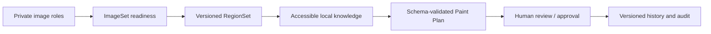

# Case study: PaintPilot

[首页](../../README.md) · [架构](../architecture.md) · [Evidence](../evidence-index.md)

## Problem

Repainting a collectible is not safely reduced to “upload an image, ask a model for colours.” The source imagery may be private; multiple images have different roles; regions must be reviewed; material advice needs a source; and a generated plan needs a human decision. A plausible paragraph is not a durable workflow.

## Product constraints

- Private images, API-only delivery, and explicit rights/ownership boundaries.
- Multiple image roles, immutable image history, ImageSet readiness, RegionSet versions, and excluded regions.
- Structured Paint Plan output rather than an unvalidated free-text answer.
- Repository-local cited retrieval distinct from structured paint inventory facts.
- Human review, approval, revision, and reproducible generation context.
- A real Provider has a cost and needs policy, accounting, and auditability.

## Solution

PaintPilot is an image-first workspace. An owner assembles an ImageSet, records readiness, creates versioned region geometry, and uses a controlled plan workflow. A plan carries the source versions and retrieval context that made it admissible; a reviewer can inspect assumptions, uncertainties, citations, and the human decision rather than treating model output as final.

## Hard engineering decisions

### Private-image egress is explicit

The browser does not receive object-store credentials or public object URLs. Before a provider path can use an image, authorization, policy and a durable claim bound the eligible resource. This makes the private-image boundary part of the workflow, not a UI convention.

### Provenance is a correctness requirement

A citation is not just a well-formed `(source_id, chunk_id)` pair. It must bind to the persisted retrieved-context bundle for that plan, otherwise a syntactically valid but forged or spliced citation could be displayed as evidence. Inventory facts are deliberately not disguised as RAG citations.

### Generation is governed, not fire-and-forget

Provider selection, encrypted BYOK, project policy, budget reservation, durable pre-egress claim, dispatch state, response validation, accounting and audit are linked lifecycle steps. The final plan remains reviewable and does not promote itself to approval.

## Failure and remediation story

One valuable lesson was that schema validation alone was insufficient for citation trust. A candidate can look valid while pairing a real source identifier with context that was never retrieved for that invocation. The remediation bound every cited pair to the stored retrieval bundle and added regressions for forged pairs, valid subsets, pair-splicing and malformed snapshots. The result is a stronger statement than “the JSON validates”: the displayed source is attributable to the actual generation context.

Another lesson was treating ambiguous provider outcomes honestly. Explicit upstream responses and true transport uncertainty are not the same state. Preserving safe measured metadata while retaining `outcome_unknown` where dispatch certainty is absent prevents accounting and user-facing status from inventing confidence.

## Outcome

PaintPilot completed real-provider proof with GLM-5V-Turbo and governed citation/provenance coverage. The Portfolio Demo intentionally uses synthetic, offline/local Fixture data with Live OFF and zero provider calls. That boundary lets an evaluator inspect the workflow without sharing a key or private image.
