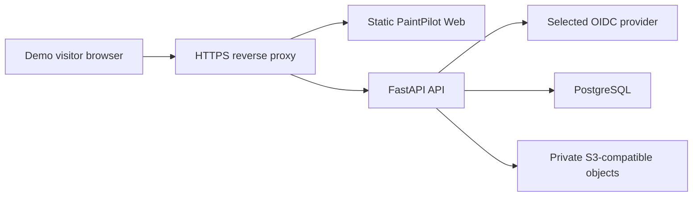

# Phase 2E public Demo deployment preparation

This document prepares a safe decision boundary; it does not deploy PaintPilot,
select a provider, create an account, register a domain, accept a credential, or
incur a charge. The local `make demo-*` profile is loopback-only test
infrastructure. Do not expose it or its project-owned OIDC provider to the
internet.

## Current topology and durable boundaries

Only the reverse proxy/Web endpoint is public. The API, PostgreSQL, and object
storage have no public listener. The Web receives neither database nor
object-store credentials and receives private images only through the authorized
API stream. The current upload contract limits image payloads to 20 MiB plus a
64 KiB multipart envelope; the local Demo proxy also applies a per-IP API limit
of 60 requests per minute with a bounded burst.

## Required operator inputs

Before an authorized deployment, the operator must provide and own:

- an exact HTTPS domain and matching certificate automation;
- a real OIDC issuer, client ID, redirect URI, and server-side client secret;
- private PostgreSQL, S3-compatible object storage, and scoped IAM credentials;
- server-side Secret injection for `DATABASE_URL`, `OIDC_CLIENT_SECRET`,
  `S3_ACCESS_KEY_ID`, and `S3_SECRET_ACCESS_KEY` (prefer the supported
  `*_FILE` inputs);
- an exact `PUBLIC_ORIGIN`, matching `TRUSTED_HOSTS`, `SECURE_COOKIES=true`,
  and `REQUIRE_CSRF_ORIGIN=true`;
- persistent database and object volumes/stores, an encrypted backup location,
  a reset-job identity, and an incident/rollback owner.

Production startup already fails closed without OIDC, private S3, an explicit
database URL, HTTPS origin, secure cookies, and exact CSRF origin. Never put
these values in Vite variables, browser storage, image build arguments, Git, or
logs.

## Synthetic data and demo access

The Phase 2E dataset is one synthetic OIDC user with a reserved `.invalid`
email, one PaintProject, four code-generated PNGs, a human READY ImageSet review,
and approved human-authored RegionSet polygons. It contains no personal image,
customer data, account, token, or AI/model result. The application seed command
uses the formal identity repository plus PaintProject, ImageAsset, readiness, and
RegionSet services; it does not write business rows directly.

For a public Demo, use a dedicated OIDC Demo identity and a database/object store
containing only this dataset. Turn on `PAINTPILOT_DEMO_READ_ONLY=true` after the
one-shot seed: it rejects every unsafe `/api/v1/` method while preserving ordinary
OIDC login/session handling. It is not an authentication bypass and defaults to
off. Do not use `IDENTITY_PROVIDER=configured_demo` outside local development or
tests; production rejects it.

The one-shot seed is additionally disabled by default. It requires explicit
`PAINTPILOT_DEMO_SEED_ENABLED=true` plus a controlled OIDC subject, display name,
and reserved `.invalid` email; it is idempotent only for the expected complete
dataset and refuses an incomplete/mixed one. Unset that flag before serving traffic.

## Edge limits, health, retention, and reset

- Terminate HTTPS at the selected proxy/load balancer and publish one exact host.
- Keep API, database, OIDC backchannel, and object storage private. Apply an
  equivalent per-IP request limit at the selected edge; retain the 20 MiB upload
  ceiling and reject over-limit requests with a clear 429/413 response.
- Monitor `GET /health/live` for the proxy and `GET /health/ready` for API,
  PostgreSQL, storage, and identity. A live 200 with ready 503 is degraded, not
  healthy.
- Retain only synthetic Demo data. Set a scheduled, separately authorized reset
  job against a dedicated Demo project/database/object store. Its preflight must
  prove the exact dataset/target before deletion; never reuse `make demo-reset`
  against a cloud environment.
- Take a minimal tested backup of the synthetic database and private object
  inventory before changing a deployment. Existing backup/restore runbooks remain
  local evidence, not a selected production backup service.

## Candidate platform constraints

| Option | Fit | Constraint before authorization |
|---|---|---|
| Container host plus managed PostgreSQL/S3/IdP | Closest to the current Docker topology | Operator must own HTTPS, private networking, IAM, Secret injection, backups, and observability. |
| Managed container platform | Works if API/Web can run as separate non-root services | Verify private egress, one exact origin, durable storage, job scheduling, and no public API/object listeners. |
| Static Web host plus separately hosted API | Possible, but only with a same-origin reverse proxy | Do not widen CORS or expose browser-held tokens to compensate for split origins. |

No provider is selected here. Expected billable resources are container compute,
managed PostgreSQL, private object storage and egress, OIDC tier, HTTPS/domain,
logs/metrics, backups, and scheduled-job execution. Actual prices, quotas, and
data residency must be checked only after the user authorizes a platform.

## Deployment gate

Before public traffic, require a separate authorization naming the cloud account,
domain, expected costs, Secret owner, selected OIDC/DB/object providers, reset and
retention owner, backup/RPO/RTO, monitoring/on-call owner, and incident process.
Then perform an independent focused review of the Phase 2E candidate before any
push, PR, or protected-main workflow.
